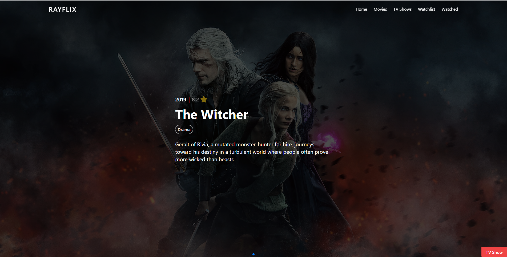
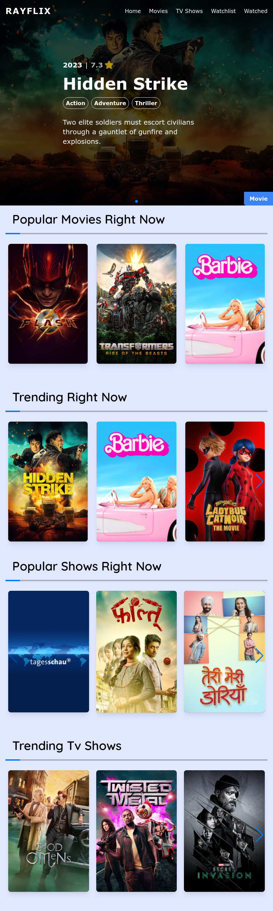

# Rayflix - Movie and TV Show Website

Rayflix is a movie and TV show website built using React. It allows users to browse and search for movies and TV shows, add them to a watchlist, and mark them as watched. The website fetches data using the TMDB API and stores watchlist and watched items data using cookies.

## Website Preview

Rayflix is designed with a user-friendly interface, providing a seamless experience for discovering and managing your favorite movies and TV shows.

## Demo

Check out the live demo of the website: [Rayflix Demo](https://rayflix-tau.vercel.app/)

## Tech Stack

The Rayflix website is built using the following technologies:

- React
- Tailwind CSS
- TMDB API
- Swiper JS

## Table of Contents

- [Features](#features)
- [Dependencies](#dependencies)
- [Deployment](#deployment)
- [Contributing](#contributing)

## Features

- Browse and search for movies and TV shows.
- Add movies and TV shows to your watchlist.
- Mark movies and TV shows as watched.
- Responsive design for various screen sizes.

## Dependencies

The project has the following dependencies:

- React
- React Router
- Axios
- Tailwind CSS
- ... (other dependencies)

## Deployment
The website is deployed using Vercel. Any new changes pushed to the main branch will trigger an automatic deployment to the live demo URL.

Demo: https://rayflix-tau.vercel.app/

## Contributing
Contributions to this project are welcome. If you find any bugs, have feature suggestions, or want to improve the code, please feel free to open an issue or submit a pull request.
